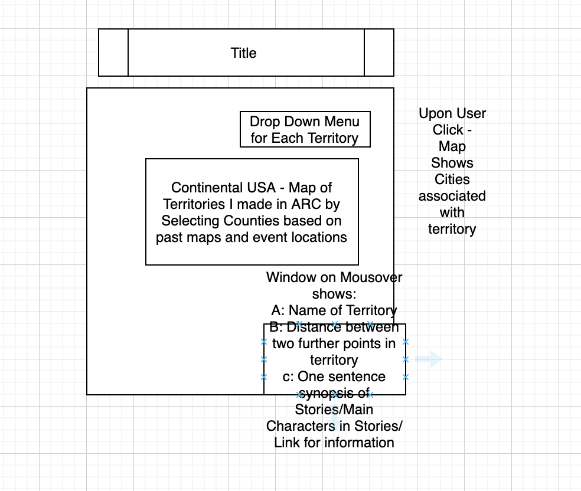

**Topic and Title** 

The Money and the Miles: The Geography of Professional Wrestling in the Territory Era

A map of NWA professional wrestling territories. Cities and are assigned to territories with the user interface. Stories are assigned to territories based on the location where they happened

**Map Objectives**

User mouses over territory for pop up which features name of territory, distance travelled between two furthest cities in the territory, and stories from that the geographical location of that territory.

**Data** 

I created all the data. I just need to process it.

**Reaction to Instructor Comments**

The territories were formed by the NWA – a cartel which sought to control space and all wrestling labor. Each promoter had control of a market or promotion – which were largely dictated by the size of the market and drive times. It really depends as Houston was it’s on territory as well as all of Florida and Georgia. Texas had at least 3 territories. Different territories would coordinate to trade talent and ‘elect’ a world chamption.

The first objective is to create the wrestling territories as an interactive map. This should be easy. I just need to figure out that lat/lon issue I emailed you about.

No – I don’t have time stamped data. The idea is to give a general idea of how large the territory was and far wrestlers would have to travel in the that territory. So really I just want the total amount of time that could be travelled within the territory. (I eventually decided on this furthest distance travlled within the territory solution)

My main contribution is creating this map and linking information to it. The best map might be pretty simple – it’s just a more effective way of organizing and presenting information and stories that currently exist.

Ok – the user interface (Drop down menu) should feature each territory. The cities that were part of that territory should appear – along with a distance measurement of how far wrestlers might travel from the two furthest places…

The main map that appears will be the all of the territories with a mouse over that reveals a window with information about the stories – The main characters, a sentence long synopsis, and finally a link to investigate it more.

**Thematic Representation**

This will be just a point on polygon map. The user interface will allow the user to toggle between different territories. 

**Content and Requirements**

I already have all of the data. 

What I need to figure out – distance between the two furthest points in the territory

And also… how to organize the window information. 

1.	Visualize the territories 
2.	Visualize the points – have the user interface show different cities and a distance from two furthest points in the territory 
3.	Organize story data for each territory

**UI**

Drop down menu provides all territories. Click to show cities…

**Mock up**

