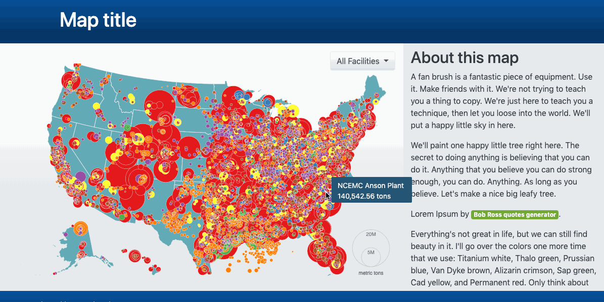
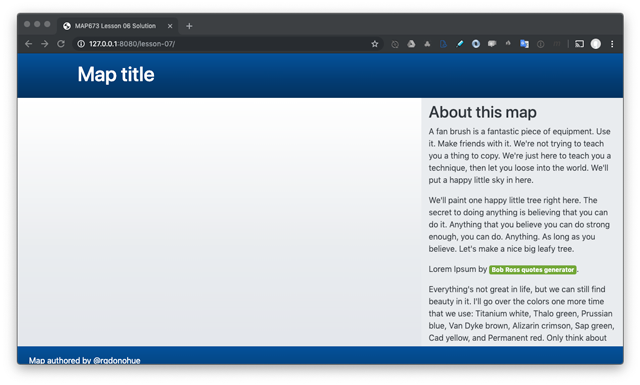
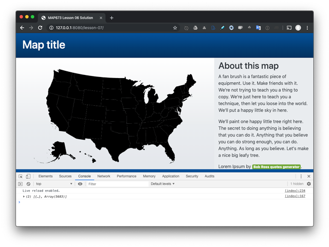
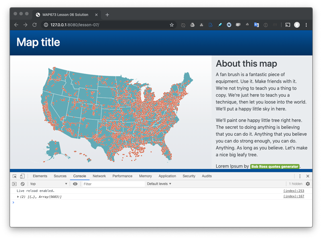
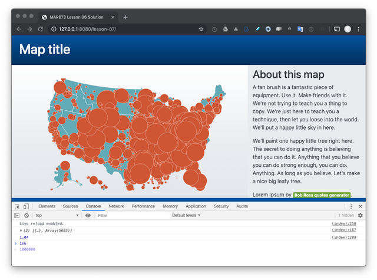
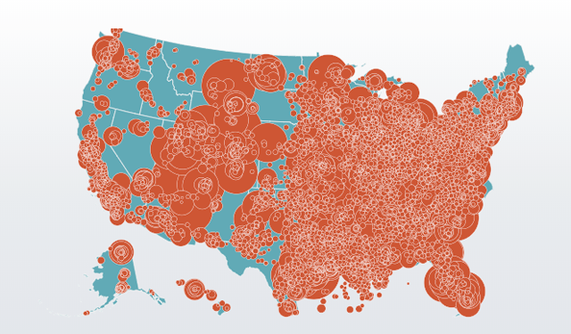
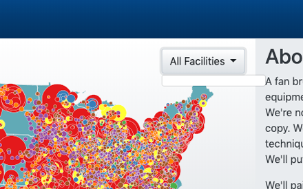
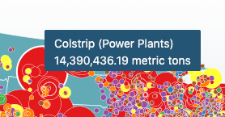

# Lesson 07: Thematic web cartography with D3 <!-- omit in toc -->

This week we continue our gentle exploration of the D3.js visualization library. You will be instructed through the process of building a bi-variate thematic map. You'll be modifying this file to create an interactive proportional symbol map of Greenhouse Gas emissions by facilities. 

## TOC <!-- omit in toc -->

- [Getting started with a template, data, and pseudo code](#getting-started-with-a-template-data-and-pseudo-code)
  - [Pseudo code](#pseudo-code)
- [Plotting the data](#plotting-the-data)
  - [Plotting point data from a CSV](#plotting-point-data-from-a-csv)
  - [Creating proportional symbols from CSV data](#creating-proportional-symbols-from-csv-data)
  - [Coloring the point features based on a nominal data attribute](#coloring-the-point-features-based-on-a-nominal-data-attribute)
- [Filtering the point data with a dropdown user interface](#filtering-the-point-data-with-a-dropdown-user-interface)
- [Adding a legend](#adding-a-legend)
- [Assignment Part I. Requirements](#assignment-part-i-requirements)
  - [Option 1 (4 points)](#option-1-4-points)
  - [Option 2 (5 points)](#option-2-5-points)

The final map after completion of the following instructions will look and behave like this (with a proper title and real "about" information, of course):

  
**Figure 01.** Assignment final map.

## Getting started with a template, data, and pseudo code

Begin by editing the **lesson-07/index.html** starter file.

The _index.html_ starter template is similar to the one used in Lesson 06. It uses Bootstrap for styling and a responsive layout.

  
**Figure 02.** Starter template.

Within the _data/_ directory you'll find a data file named [_facility-emissions-2016.csv_](data/facility-emissions-2016.csv) (wrangled from the accompanying [_ghgp_data_2016_8_5_17.xlsx_](ghgp_data_2016_8_5_17.xlsx) file, for your reference). These data were downloaded from the [EPA Air Emissions Inventories](https://www.epa.gov/air-emissions-inventories/emissions-inventory-system-eis-gateway).

Open the CSV file and first look at the data:

```csv
Facility_Id,Facility_Name,City,State,Zip Code,Address,County,Latitude,Longitude,Industry_Type,Total
1005268,BERNICE LAKE,NIKISKI,AK,99635,55244 CHEVRON REFINERY ROAD,KENAI PENINSULA BOROUGH,60.69,-151.39,Power Plants,398.25
1006162,Hecla Greens Creek Mine,Juneau,AK,99801,3000 Vintage Blvd 300,JUNEAU,58.08,-134.64,Other,6178.35
1007791,CLEAR AIR FORCE STATION,CLEAR AIR STATION,AK,99704,200 A Street Stop 1,DENALI,64.29,-149.19,Power Plants,6201.18
1005004,ConocoPhillips ANGC - LNG,Kenai,AK,99611,48237 Kenai Spur Highway,KENAI PENINSULA BOROUGH,60.68,-151.38,Petroleum and Natural Gas Systems,12243
1010389,Capitol Disposal Landfill,Juneau,AK,99801,5600 Tonsgard Court,JUNEAU,58.35,-134.5,Waste,16286.34
1011795,TRANS ALASKA PIPELINE SYSTEM PUMP STATION 7,Fairbanks,AK,99706,,YUKON KOYUKUK,70.26,-148.62,Other,16520.28
```

Importantly, we notice that there are columns `Latitude` and `Longitude` that hold WGS84 un-projected coordinates. We can use these values to plot the point features on our map. The `Total` attribute records the total amount of greenhouse gas emissions (in metric tons). There is also an `Industry_Type` attribute.

There is also a Topojson file, _us-states.json_, converted from Shapefiles downloaded from the [US Cartographic Boundary files](https://www.census.gov/geographies/mapping-files/time-series/geo/carto-boundary-file.html).

Our goal is to create map that meets the following requirements:

1. Draw the US states to the map and plots the facility emissions point features over the states.
2. Use the visual variable of size to encode the qualitative amount of gas emissions from each facility.
3. Provide a legend indicated what the size of the circles represents.
4. Use the visual variable of hue (or color) to encode the categorical data attribute of industry type.
5. Provide a tooltip to allow the user to retrieve specific information about individual features (i.e., name of facility, ID, etc).
6. Provide a user interface allowing the user to filter the map by industry type.
7. Update lorem ipsum text, map title, etc.

### Pseudo code

It's often helpful to think about the script you intend to write and plan a strategy using pseudo code. Pseudo code will be more human readable than scripted code, within specific syntax. It's helpful for thinking about the anticipated flow of execution of the script and how to organize various routines and statements within functions.

The following demonstrates pseudo code for achieving the map requirements listed above:

* request and parse the data
* create an SVG element for drawing elements
* draw the state polygon features
* draw the point features
* resize the point features based on "Total" attribute
* color the point features based on "Industry Type" attribute
* add a tooltip for retrieving information about the point features
* add a user interface for filtering the point features by "Industry Type"
* add a legend

## Plotting the data

First we need to load our data into our script. Again, the preferred way to do this is with AJAX requests, and D3 provides an easy way to do this for both the TopoJSON file and the CSV file.

We'll again use the `Promise.all()` method to ensure the data are all loaded before the script continues.

```js
// asynchronous calls to data files
const statesJson = d3.json('data/us-states.json');
const facilityCSV = d3.csv('data/facility-emissions-2016.csv');

// use promise to call all data files, then send data to callback
Promise.all([statesJson, facilityCSV])
  .then(drawMap)
  .catch(error => {
    console.log(error)
  });

  // function called when Promise above is complete
function drawMap(data) {
  
  console.log(data);  // our two datasets within an array

  // data is array of our two datasets
  const statesData = data[0];
  const facilityData = data[1];
}
```

Note that we have created two variables to refer to the two datasets. Also as always, you should have your web developer toolbar open and be logging information to the console to better understand how the script is working.

Next, within the `drawMap()` function body, we can create the SVG and append it to the existing HTML `<div id="map"></div>`.

```js
// select the HTML element that will hold our map
const mapContainer = d3.select('#map')

// determine width and height of map from container
const width = mapContainer.node().offsetWidth - 60;
const height = mapContainer.node().offsetHeight - 60;

const svg = mapContainer
  .append('svg')
  .attr('width', width)
  .attr('height', height)
  .classed('position-absolute', true) // add bootstrap class
  .style('top', 40)
  .style('left', 30);
```

Once again, we can use the topojson.js library to convert the TopoJSON file into GeoJSON within the script. We can use that to fit the extent of the projection. Here again we're using the D3's geoAlbersUsa projection to create our path generator. 

```js
const geojson = topojson.feature(statesData, {
  type: 'GeometryCollection',
  geometries: statesData.objects.cb_2016_us_state_20m.geometries
});

const projection = d3.geoAlbersUsa()
  .fitSize([width, height], geojson);

const path = d3.geoPath()
  .projection(projection);
```

We're now ready to draw some of our data to the map. To do so, we'll use the following code:

```js
const states = svg.append('g')
  .selectAll('path')
  .data(geojson.features)
  .join('path')
  .attr('d', path)
  .attr('class', 'state');
```

**Test your understanding:** Comment all of the statements within the previous code bank.

We can see our geometries projected and drawn to the map.

  
**Figure 03.** State boundaries.

We can include a CSS rule in the head of our document to select these path elements and apply some style rules.

```css
.state {
  fill: #61aab6;
  stroke: whitesmoke;
  stroke-width: .7;
}
```

  
**Figure 04.** State boundaries with style rule applied.

### Plotting point data from a CSV

While we could convert our CSV to a GeoJSON and use a similar technique for drawing the facilities to the map, remember that CSV is often the smallest flat file format you can store your data in. Let's take advantage of this file size then, and figure out how to draw point features to our map.

Consider the following code (written within the `drawMap()` function below the code that added the states to the SVG). Remember that this is a single JavaScript statement, and we're chaining methods to the selection.

```js
const facilities = svg.append('g')  // append new g element
  .selectAll('circle')  // select all the circles
  .data(facilityData)  // use the facility CSV data
  .join('circle')  // join that data to circle elements
  .attr('cx', d => {  // feed the long/lat to the projection generator
    d.position = projection([d.Longitude, d.Latitude]);  // create a new data attribute
    return d.position[0];  // position the x
  })
  .attr('cy', d => {
    return d.position[1];  // position the y
  })
  .attr('r', 2)  // define the radius
  .attr('class', 'facility');  // give each circle a class name
```

Rather than creating a SVG path element for each feature (like we did with the polygons), when drawing point features we can instead create [SVG circle](https://developer.mozilla.org/en-US/docs/Web/SVG/Element/circle) elements for each. A circle element will always have at least three attributes:

*  `cy` (vertical pixel distance from the top left corder of the parent SVG element to the center of the circle),
*  `cx` (horizontal pixel distance from the top left corder of the parent SVG element to the center of the circle), and 
*  `r` (the radius in pixels)

For example, the following markup creates a [SVG circle element](https://codepen.io/pen/?&editable=true) within a HTML document:

```html
<svg viewBox="0 0 100 100" xmlns="http://www.w3.org/2000/svg">
  <circle cx="50" cy="50" r="50"/>
</svg>
```

Again, we'll want to include a CSS style rule to select these SVG circle elements and style them. We can also include a hover affordance.

```css
.facility {
  fill: #cf5635;
  stroke: white;
  stroke-width: .3;
  opacity: 1;
}

.facility:hover {
  stroke-width: 2;
}
```

We now have our point features plotted to the map:

  
**Figure 05.** Point data from CSV drawn to the SVG.

### Creating proportional symbols from CSV data

Next, we want to resize these circles based on a data attribute ("Total"). How do we go about this?

One solution is use one of [D3's built in scale methods](https://github.com/d3/d3-scale). Place the following code above your code that creates the circle elements:

```js
// define radius generator
const radius = d3.scaleSqrt().domain([0, 1e6]).range([1, 9]);
```

To deeply understand this statement you'll need to search D3's API documentation for the `.scaleSqrt()`, `.domain()`, and `.range()` methods and read about them ([d3.scaleSqrt()](https://github.com/d3/d3-scale#scaleSqrt)).

Essential this statement creates a function named `radius` that returns the square root of a number passed to it. For example, after that statement you could do this:

```js
console.log(radius(25)); // output is 1.04
```

The input _domain_ is the range of possible data values. Since we don't know that range we're simply allowing for between 0 and 1,000,000. The output _range_ is the range of possible output values. Here we are telling the script to make the smallest value a pixel of 1 and the largest a pixel of value of 9.

Replace the chained method for the radius attribute with the following:

```js
.attr('r', d => {
  return radius(+d.Total);
})
```

  
**Figure 06.** SVG circle elements resized.

Also, importantly, notice how you can access property data within the callback function:

```js
.attr('r', d => {
  console.log(d); // access to the data here!!!
  return radius(+d.Total);
})
```

This is an effective solution for creating the proportional symbol map. Although, we can see that larger circles are now plotted atop the smaller ones. To remedy this, we can sort our facilities data based on the "Total" attribute before plotting.

Update your code:

```js
.data(facilityData.sort(function (a, b) {
  return b.Total - a.Total; // place the large ones on the bottom
}))
```

This will then draw the large ones first and the smaller ones after.

  
**Figure 07.** SVG circle elements sorted and resized.

Okay, we now have a proportional symbol map, though very cluttered and nearly unintelligible. Let's move forward to consider a couple different techniques for improving this map. Specifically, we're going to modify the data representation (to encode the circles with color) and use an interaction solution to filter the points.

### Coloring the point features based on a nominal data attribute

We'll again use D3 to create a new function we can pass string values to (the "Industry Type" attributes from our data) and have it return a color value.

Above the statement that creates the SVG circles, write this statement:

```js
// define color generator
const color = d3.scaleOrdinal(d3.schemeSet1);
```

The `.scaleOrdinal()` method will map a set of named categories (our "Industry Type" values) to a set of colors. For this we're using a pre-determined set of categorical colors. D3 provides a variety of scaled color solutions using the [d3-scale-chromatic](https://github.com/d3/d3-scale-chromatic#schemeSet1) module.

  
**Figure 08.** [D3 schemeSet1](https://github.com/d3/d3-scale-chromatic#schemeSet1).

For example, you could now pass a string value to the function and it will return a hexadecimal color value:

```js
console.log(color('Power Plants')); // output is #e41a1c
```

**Test your knowledge:** Why are distinct categorical colors more appropriate here than a continuous scheme using different saturation levels of a single color?

Next, we can chain an additional method to our statement creating our SVG circles to create a CSS style rule changing the color.

```js
.style('fill', d => {
  return color(d.Industry_Type);
})
```

We've now created a bivariate thematic map using the data from the facility emissions CSV file.

  
**Figure 09.** SVG circles with fill colors based on category values.

While coloring them based on the industry type category makes the map more meaningful and legible, we can further improve the user experience by introducing some interactivity to both retrieve specific feature information and to filter the features in a meaningful way.

## Filtering the point data with a dropdown user interface

To filter the data we need to provide the user with an interface. The solution we'll implement here is a classic dropdown menu (though radio buttons would also work).

First, we'll add the necessary HTML elements for a dropdown. Here, we'll use [Bootstrap's dropdowns solution](https://getbootstrap.com/docs/4.0/components/dropdowns/).

Within your _index.html_, notice that there is markup commented out. Uncomment this markup:

```html
<div id="ui" class="dropdown">
<a class="btn btn-secondary dropdown-toggle" href="#" role="button" id="dropdownMenuLink" data-toggle="dropdown"
  aria-haspopup="true" aria-expanded="false">
  All facilities
</a>
<div class="dropdown-menu" aria-labelledby="dropdownMenuLink"></div>
</div>
```

You should now see an empty dropdown UI in the top right of the map:

  
**Figure 10.** An empty dropdown ui.

Important to understand is that the element is positioned within the map and over the map because of the following CSS rule:

```css
#ui {
   position: absolute;
   right: 1em;
   top: 1em;
}
```

The `<div id="map"></div>` element has relative positioning, and the UI element is positioned absolutely within it. Hence it is `1em` from the right size of the `<div id="map"></div>` element and `1em` from the top.

Now that we have the HTML/CSS component for our UI, we need to write some JavaScript to wire this interface to changes in our map.

Declare a new function **outside of the `drawMap()` function body**. Write this function with two parameters: 

```js
function filterByAttribute(facilityData, facilities) {
  // code
}
```

Then, at the bottom of the `drawMap()` function body, call the function and pass as arguments the references to the CSV facility data and the D3 selection of the facility circles we created:

```js
filterByAttribute(facilityData, facilities);
```

Next, within the `filterByAttribute()` function body, the following code will create an Array of our unique values of industry types.

```js
// array to hold select options
var uniqueTypes = [];

// loop through all features and push unique types to array
facilityData.forEach(function (facility) {
  if (!uniqueTypes.includes(facility.Industry_Type)) {
    uniqueTypes.push(facility.Industry_Type);
  }
});

// sort strings alphabetically
uniqueTypes.sort();

// add an all facilities to the beginning
uniqueTypes.unshift('All facilities');
```

Next we will dynamically create the HTML elements comprising the dropdown options. This code is tricky, and also notice that it's using the structure and attributes of the suggested Bootstrap dropdown solution (i.e., creating anchor elements for each of our unique industry type values):

```js
// select all the options (that don't exist yet)
d3.select('#ui .dropdown-menu').selectAll('a')
  .data(uniqueTypes) // use array as data
  .join('a') // append a new option element for each data item
  .text(d => {
    return d // use the item as text
  })
  .attr('value', d => {
    return d // use the time as value attribute
  })
  .attr('href', '#')
  .classed('dropdown-item', true)
  .on('click', onchange);  // when the user clicks call onchange function
```

And we'll include a function within the `filterByAttribute()` function body to:

1. determine which dropdown item was selected,
2. display any selected circle (or all of them),
3. update the UI with the current selection

```js
function onchange() {
  // get the currently selected value
  let val = d3.select(this).attr('value');
  
  // change the display property for each circle
  facilities.style('display', d => {
    if (val === 'All facilities') return 'inline';
    if (d.Industry_Type != val) return 'none';
  });

  d3.select('#ui > a').html(val);  // update the UI with current val
}
```

If all went well, you should have a working filer UI that updates the map with the selection:

  
**Figure 11.** Filter UI updating the map.

We now have a functioning UI filter that dynamically updates the map.

## Adding a legend

Next, create a legend for the sizes of the circles. Encapsulate this code within its own function (**outside of the `drawMap()` function body):

```js
function drawLegend(svg, width, height, radius) {

   const legend = svg.append('g')
     .attr('dy', '1.3em')
     .attr('class', 'legend')
     .attr('transform', 'translate(' + (width - 40) + ',' + (height - 20) + ')')
     .selectAll('g')
     .data([5e6, 2e7])
     .join('g');

   legend.append('circle')
     .attr('cy', d => {
       return -radius(d);
     })
     .attr('r', radius);

   legend.append('text')
     .attr('y', d => {
       return -2 * radius(d);
     })
     .attr('dy', '1.3em')
     .text(d3.format('.1s'));

   legend.append('text')
     .attr('y', 16)
     .text('metric tons');
 }
 ```

 Notice that we're going to pass four arguments to the function. Then, call the function from the bottom of the `drawMap()` function body.

 ```js
 filterByAttribute(facilityData, facilities, color);
 ```

 You should now see a simple legend placed on the map.

   
**Figure 12.** Legend for the circle size.

Also note the role the CSS rules within the starter template are playing. Because we're creating the legend using SVG, these style rules are for the SVG circle and text elements (and not HTML).

```css
.legend circle {
  fill: none;
  stroke: #ccc;
}

.legend text {
  fill: #777;
  font: 10px sans-serif;
  text-anchor: middle;
}
```

This concludes the lesson. Take a break, then move on to read the lesson assignment requirements below and the instructions for the [assignment](assignment/README.md) assignment (which solely involves your final project proposal).


## Assignment Part I. Requirements

Pick one of the following options.

### Option 1 (4 points)

Finish the assignment as outlined above using the US states and the facility emissions data. Complete the following requirements, beyond what I detailed above:

* Code is cleanly written, indented, and uses semantically meaningful variable and function names
* Map includes a tooltip allowing the user to retrieve specific information about each facility, minimally including the name of the facility and a well-formatted output of the total metric tons of greenhouse gas emissions reported.
    
  **Figure 13.** Tooltip example.
* update map title, author, and links to appropriate meta data

Commit your changes as you work and push the remote repository for help and final submission.

### Option 2 (5 points)

First, fulfill the requirements for Option 1. Save these within the _lesson-07/index.html_ file.

Then create a new map with a new dataset of your choosing using D3. Create a new HTML document for your map and save it within _assignment/index.html_.

You're limited to neither the US nor point symbol data, and you may consider [other thematic types](https://bl.ocks.org/mbostock/2522624ada2c1f9e0fafb75cca09442b).

Commit your changes as you work and push the remote repository for help and final submission.